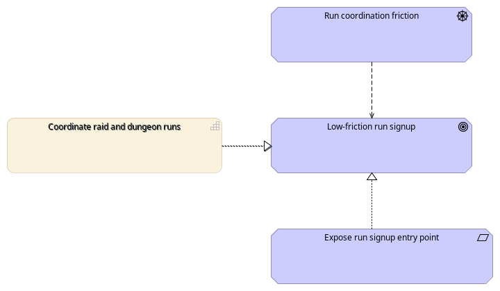

# LFM Architecture

ArchiMate® 3.2 model of the LFM application — Blazor WebAssembly SPA + Azure Functions API + Cosmos / Storage / Key Vault on a single-environment Azure deployment. The canonical source is [`lfm.oef.xml`](lfm.oef.xml), serialised in The Open Group **Model Exchange File Format** (OEF) so it loads in Archi, BiZZdesign, Sparx EA, and any ArchiMate-conformant tool.

The model was recreated on 2026-05-01 with `souroldgeezer-design:architecture-design` 0.21.0 from the repository's .NET solution, Bicep IaC, and GitHub Actions workflows (Application + Technology + Implementation & Migration layers). Technology Realisation, Technology Security, and Run Signup Service Realization were reflowed through `arch-layout.sh layout-elk` (`elk-layered` 0.11.0) and then source-geometry validated. It describes the production-facing runtime surface; test-only Functions compiled behind `#if E2E`, such as `/api/e2e/login`, are deliberately excluded from the Application Interface inventory. Strategy, Business, and Motivation elements are stubbed `FORWARD-ONLY` — they exist as placeholders for the architect to fill in; their names are inferred from the application surface and have not been validated against business stakeholders.

## Views

| # | View | Viewpoint | Render |
|---|---|---|---|
| 1 | Application Cooperation | `Application Cooperation` | [`id-view-app-cooperation.png`](renders/id-view-app-cooperation.png) |
| 2 | Technology Realisation (Hosting + Data Plane) | `Technology Usage` | [`id-view-technology.png`](renders/id-view-technology.png) |
| 3 | Technology Security (MI + RBAC) | `Technology Usage` | [`id-view-technology-security.png`](renders/id-view-technology-security.png) |
| 4 | Production Release Migration | `Migration` | [`id-view-migration.png`](renders/id-view-migration.png) |
| 5 | Capability Map (FORWARD-ONLY scaffold) | `Capability Map` | [`id-view-capability-map.png`](renders/id-view-capability-map.png) |
| 6 | Motivation (FORWARD-ONLY scaffold) | `Motivation` | [`id-view-motivation.png`](renders/id-view-motivation.png) |
| 7 | Run Signup — Business Process Cooperation | `Business Process Cooperation` | [`id-view-business-processes.png`](renders/id-view-business-processes.png) |
| 8 | Run Signup — Service Realization (Process-rooted) | `Service Realization` | [`id-view-service-realization.png`](renders/id-view-service-realization.png) |

### 1. Application Cooperation


LFM-internal vs Blizzard-external trust boundary, drawn explicitly with two `Grouping`s. Inside LFM: `Lfm.App.Core` serves `Lfm.App` (Blazor WASM SPA); `Lfm.Contracts` (shared DTO library) serves all three internal projects; `Lfm.Api` (Azure Functions HTTP API) exposes the `REST API (/api/*)` interface that serves `Lfm.App`. Canonical public routes are `/api/v1/...`; the unprefixed `/api/...` routes are transitional live aliases tracked in [`docs/api-versioning.md`](../api-versioning.md) until their telemetry-backed retirement criteria are met. Inside Blizzard: `Battle.net OAuth 2.0` serves `Lfm.Api` (login flow); `WoW Profile API` and `WoW Game Data API` serve `Lfm.Api` (character + reference data); the Blizzard Render CDN serves character render images directly to the SPA browser (CSP-allowlisted).

### 2. Technology Realisation (Hosting + Data Plane)


The Azure resources and data-plane artifacts (single resource group, single region) with their hosting + data-plane relationships: `Azure Static Web Apps` hosts `Lfm.App`; `Azure Function App` hosts `Lfm.Api` on an App Service Plan using the committed Y1 Dynamic SKU and the nested Azure Functions runtime; the Function App consumes `Cosmos DB account` (Free Tier, `disableLocalAuth=true`), `Storage account` (Standard_LRS, `allowSharedKeyAccess=false`), and `Key Vault` (RBAC-authorized) as data-plane services; `Application Insights` is workspace-based, aggregated by `Log Analytics workspace`. This view keeps the runtime topology separate from the managed-identity `Access` edges shown in Technology Security. The Cosmos SQL database Artifact, container Artifacts, diagnostic-settings flows, and the Action Group + Cosmos throttle alert are tracked in the model but reserved for detail views.

### 3. Technology Security (MI + RBAC)


How `Lfm.Api` authenticates to every data-plane resource. The Function App carries a system-assigned managed identity (no client secrets, no shared keys). The MI is represented in the model as a `TechnologyService` to show the RBAC-authorized access surface; it is not a standalone Azure resource. The MI is granted six baseline data-plane RBAC roles in [`infra/modules/functions.bicep`](../../infra/modules/functions.bicep): **Key Vault Secrets User** on the Vault, **Cosmos DB Built-in Data Contributor** on the account, **Storage Blob Data Owner** + **Queue Data Contributor** + **Table Data Contributor** on the account, **Monitoring Metrics Publisher** on Application Insights (the last is required because App Insights has `DisableLocalAuth=true`). [`infra/modules/dataprotection.bicep`](../../infra/modules/dataprotection.bicep) adds the Data Protection-specific **Key Vault Crypto User** and **Storage Blob Data Contributor** grants for the encrypted key ring. Cosmos `disableLocalAuth=true` and Storage `allowSharedKeyAccess=false` make RBAC the **only** authentication path; the `Access` edges from Function App MI to the resources represent the required role assignments rather than runtime hosting or dependency topology.

### 4. Production Release Migration


CI/CD release path lifted from [`.github/workflows/`](../../.github/workflows/). LFM deploys to **one** environment (`production`); `deploy.yml` has no environment input and tags every resource `environment=production`. The Deploy orchestrator aggregates Deploy Infrastructure (Bicep what-if + apply), Deploy App-Build (Functions zip + Blazor wwwroot bundle), and Deploy App (uploads to Function App + SWA). The Migration view now shows a Repository Baseline Plateau, a Release to production Gap, the Deploy to Production Implementation Event, and the resulting Production Plateau. `Dev` and `Staging` plateaus exist as `FORWARD-ONLY` stubs in `<elements>` for future multi-environment work but are not drawn here. CI / E2E Smoke / Secret Scanning / Analyze Infrastructure / License Compliance / Dep License Check / Dependabot Auto-Merge are tracked but not visualised; they gate relevant PRs and do not realise the Plateau. Full E2E and Stryker Nightly (App.Core) remain broader manual or scheduled advisory signals rather than every-PR gates.

### 5. Capability Map (FORWARD-ONLY scaffold)


Three-row realisation chain for the architect to iterate on: real **Application Services** (lifted from `api/Functions/*`) → forward-only **Business Services** (suggestive labels inferred from the API surface) → forward-only **Strategy Capabilities** (architect to validate or rename). The three Capabilities ("Coordinate raid and dungeon runs", "Guild roster management", "Personal character portfolio") are placeholders — they have not been validated against business stakeholders and are likely incomplete (no Account / Authentication capability is stubbed yet, no Stakeholders are modeled, and the Motivation layer is only a minimal run-signup seed rather than a full capability rationale).

### 6. Motivation (FORWARD-ONLY scaffold)



Forward-only seed for the "why" behind the run-signup capability. It connects the inferred `Run coordination friction` Driver to the inferred `Low-friction run signup` Goal, shows the `Coordinate raid and dungeon runs` Capability as part of the rationale trace, and adds the `Expose run signup entry point` Requirement as the design constraint that realizes the goal. These elements are placeholders derived from the current product surface, not validated stakeholder intent; the architect should replace or refine them before using the view as governance evidence.

### 7. Run Signup — Business Process Cooperation (FORWARD-ONLY)


§9.7 Business Process Cooperation view of the user-driven "Sign up for run" flow. **Active structure** (top): a `Player` Business Actor Assigned to every user-driven Behaviour. **Behaviour** (middle, left-to-right Triggering chain): an entry `Player wants to join a run` Business Event → `Browse open runs` (realised by `RunsListFunction`) → `Inspect run detail` (`RunsDetailFunction`) → `Sign up for run` (`RunsSignupFunction`) → terminal `Signup confirmed` Business Event; an alt-path Flow from `Sign up for run` to `Cancel signup` (`RunsCancelSignupFunction`). **Passive structure** (bottom): `Run` and `Signup` Business Objects, Accessed by the Behaviour steps that read or write them. LFM has no Durable Functions orchestrators or Logic Apps, so this chain is architect-authored rather than lifted (per architecture-design `references/procedures/lifting-rules-process.md`); forward-only status is retained in element documentation rather than repeated in visible labels. Names and chain shape have **not** been validated against business stakeholders.

### 8. Run Signup — Service Realization (Process-rooted)


§9.3 Service Realization drill-down for the run-signup Business Process chain. The four process steps from the sibling cooperation view (`Browse open runs`, `Inspect run detail`, `Sign up for run`, and alternate-path `Cancel signup`) are shown together because they share the same real realization chain: `Run Management` Application Service → `Lfm.Api` Application Component → `Azure Function App`, with `Azure Cosmos DB account` serving the Function App on the data plane. The user-driven entry point is the UI Application Component [`app/Pages/RunsPage.razor`](../../app/Pages/RunsPage.razor), with `/runs` serving the list step and `/runs/{RunId}` serving inspect/sign-up/cancel affordances. Keeping this as one view makes the shared implementation explicit instead of repeating four near-identical diagrams.

## Forward-only scope

The Application, Technology, and Implementation & Migration layers are extracted from source — every element traces back to a `*.csproj`, a `*.bicep` resource, or a `.github/workflows/*.yml` file. The Strategy, Business, and Motivation layers are emitted as **forward-only stubs** per the architecture-design skill's §7.2 contract; their names are *suggestive*, not *authoritative*, and the architect owns their content. Stub elements carry a `FORWARD-ONLY stub` prefix in their `<documentation>` while visible labels stay concise for rendered views. The Physical Layer is omitted entirely — there are no on-premises devices.

## How to view & edit

Open `lfm.oef.xml` in any ArchiMate-conformant tool:

- **[Archi](https://www.archimatetool.com/)** (the reference implementation used by the `architecture-design render` helper): **File → Import → Open Exchange XML File**, point at `docs/architecture/lfm.oef.xml`.
- **BiZZdesign Enterprise Studio** / **Sparx EA** / **Avolution ABACUS** / **HOPEX** — all import OEF natively.

Edits made in any tool that round-trips OEF can be exported back over `lfm.oef.xml`. Archi-specific canvas features (custom figures, group styling presets) are not preserved by OEF; the model is portable, the canvas is not.

## How to regenerate the renders

The PNGs in [`renders/`](renders/) are produced by the `souroldgeezer-design:architecture-design` render helper, which runs Archi headlessly:

```bash
architecture-design render .        # regenerate every view to .cache/archi-views/lfm/
cp .cache/archi-views/lfm/*.png docs/architecture/renders/
```

The helper writes to `.cache/archi-views/<stem>/` (gitignored) by default; copy the outputs over `docs/architecture/renders/` to update the committed snapshots. Requirements: the `souroldgeezer-design:architecture-design` plugin, an `Archi` binary at `$HOME/.local/bin/Archi` or configured equivalent, `xmllint`, `realpath`, and an `$DISPLAY` (use `xvfb-run` on pure Wayland without Xwayland). Do not reference versioned Codex plugin cache paths in this repo; refresh or reinstall the local plugin if `architecture-design render` is missing from the installed runtime.

When `*.oef.xml` changes, regenerate and commit the corresponding files in [`renders/`](renders/) as part of the same architecture update; update this README whenever the view inventory, names, or source provenance changes.

## Source provenance

| ArchiMate Layer | Lifted from |
|---|---|
| Application | [`lfm.sln`](../../lfm.sln), [`api/Lfm.Api.csproj`](../../api/Lfm.Api.csproj), [`app/Lfm.App.csproj`](../../app/Lfm.App.csproj), [`app/Lfm.App.Core/Lfm.App.Core.csproj`](../../app/Lfm.App.Core/Lfm.App.Core.csproj), [`shared/Lfm.Contracts/Lfm.Contracts.csproj`](../../shared/Lfm.Contracts/Lfm.Contracts.csproj), [`api/host.json`](../../api/host.json), [`api/Program.cs`](../../api/Program.cs), [`api/Functions/`](../../api/Functions/) production-facing HTTP/Timer surface only, [`app/wwwroot/staticwebapp.config.json.template`](../../app/wwwroot/staticwebapp.config.json.template) |
| Technology | [`infra/main.bicep`](../../infra/main.bicep) + [`infra/modules/`](../../infra/modules/) (8 modules: cosmos, storage, functions, keyvault, swa, loganalytics, alerts, dataprotection) |
| Implementation & Migration | [`.github/workflows/`](../../.github/workflows/) (12 workflows: ci, deploy, deploy-infra, deploy-app-build, deploy-app, e2e, analyze-infra, secrets-scan, license-compliance, dep-license-check, stryker-nightly, dependabot-auto-merge) |
| Strategy / Business / Motivation | **FORWARD-ONLY** — architect-authored placeholders |

Re-extracting the model is a clean operation: delete `lfm.oef.xml` and re-run the `souroldgeezer-design:architecture-design` skill in Extract mode. Hand edits made in Archi survive re-extraction when the OEF is round-tripped.
