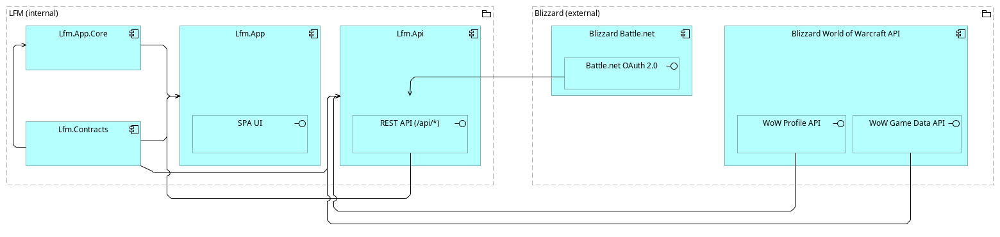
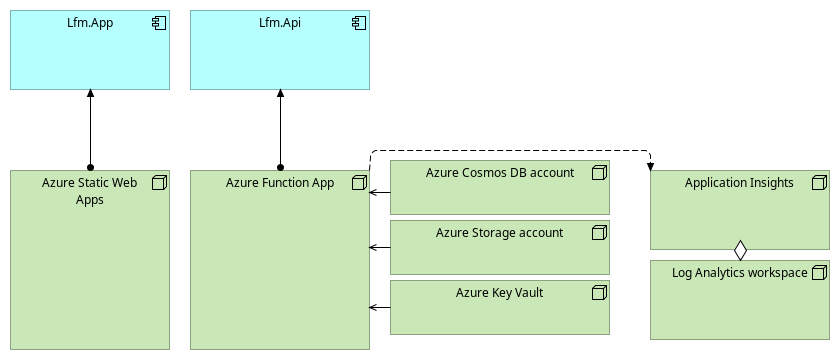
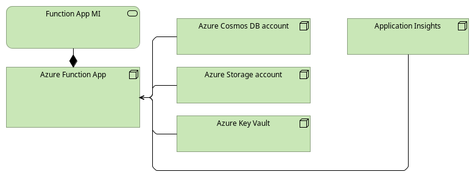
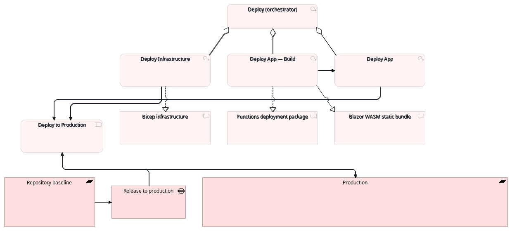
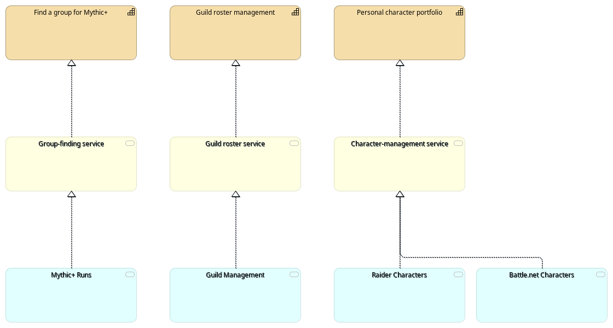
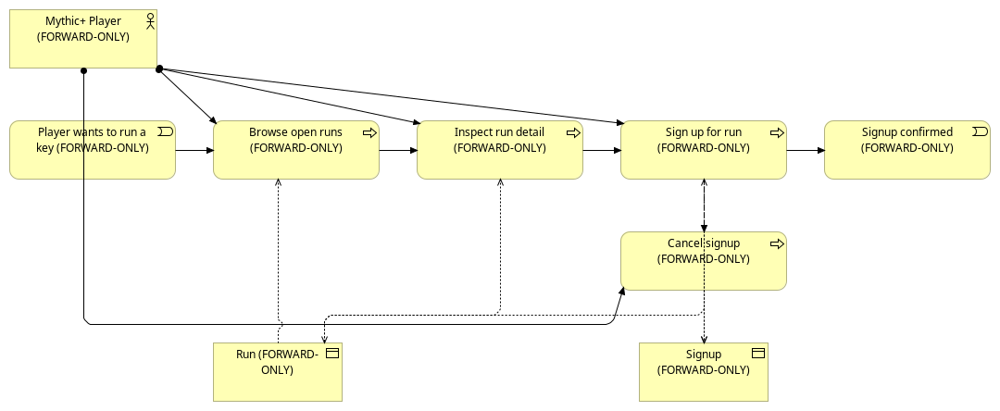
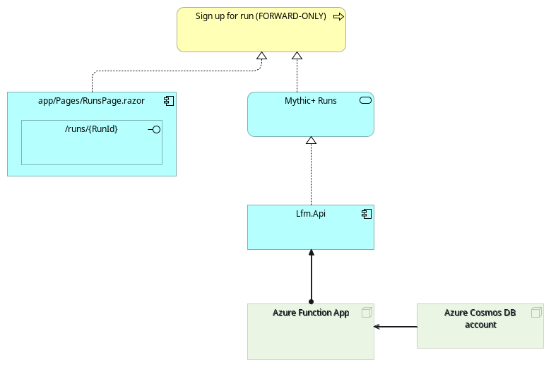

# LFM Architecture

ArchiMate® 3.2 model of the LFM application — Blazor WebAssembly SPA + Azure Functions API + Cosmos / Storage / Key Vault on a single-environment Azure deployment. The canonical source is [`lfm.oef.xml`](lfm.oef.xml), serialised in The Open Group **Model Exchange File Format** (OEF) so it loads in Archi, BiZZdesign, Sparx EA, and any ArchiMate-conformant tool.

The model was lifted from the repository's .NET solution, Bicep IaC, and GitHub Actions workflows (Application + Technology + Implementation & Migration layers). Strategy, Business, and Motivation elements are stubbed `FORWARD-ONLY` — they exist as placeholders for the architect to fill in; their names are inferred from the application surface and have not been validated against business stakeholders.

## Views

| # | View | Viewpoint | Render |
|---|---|---|---|
| 1 | Application Cooperation | `Application Cooperation` | [`id-view-app-cooperation.png`](renders/id-view-app-cooperation.png) |
| 2 | Technology Realisation (Hosting + Data Plane) | `Technology Usage` | [`id-view-technology.png`](renders/id-view-technology.png) |
| 3 | Technology Security (MI + RBAC) | `Technology Usage` | [`id-view-technology-security.png`](renders/id-view-technology-security.png) |
| 4 | Deployment Topology (single-environment) | `Migration` | [`id-view-migration.png`](renders/id-view-migration.png) |
| 5 | Capability Map (FORWARD-ONLY scaffold) | `Capability Map` | [`id-view-capability-map.png`](renders/id-view-capability-map.png) |
| 6 | Mythic+ Run Signup — Business Process Cooperation | `Business Process Cooperation` | [`id-view-business-processes.png`](renders/id-view-business-processes.png) |
| 7 | Sign up for run — Service Realization (Process-rooted) | `Service Realization` | [`id-view-service-realization.png`](renders/id-view-service-realization.png) |

### 1. Application Cooperation



LFM-internal vs Blizzard-external trust boundary, drawn explicitly with two `Grouping`s. Inside LFM: `Lfm.App.Core` serves `Lfm.App` (Blazor WASM SPA); `Lfm.Contracts` (shared DTO library) serves all three internal projects; `Lfm.Api` (Azure Functions HTTP API) exposes the `REST API (/api/*)` interface that serves `Lfm.App`. Inside Blizzard: `Battle.net OAuth 2.0` serves `Lfm.Api` (login flow); `WoW Profile API` and `WoW Game Data API` serve `Lfm.Api` (character + reference data); `render.worldofwarcraft.com` is consumed directly by the SPA browser (CSP-allowlisted).

### 2. Technology Realisation (Hosting + Data Plane)



The seven Azure resources (single resource group, single region) with their hosting + data-plane relationships: `Azure Static Web Apps` hosts `Lfm.App`; `Azure Function App` hosts `Lfm.Api` and consumes `Cosmos DB account` (Free Tier, `disableLocalAuth=true`), `Storage account` (Standard_LRS, `allowSharedKeyAccess=false`), and `Key Vault` (RBAC-authorized) as data-plane services; `Application Insights` is workspace-based, aggregated by `Log Analytics workspace`. App Service Plan SKU, Functions runtime version, container Artifacts, diagnostic-settings flows, and the Action Group + Cosmos throttle alert are tracked in the model but reserved for detail views.

### 3. Technology Security (MI + RBAC)



How `Lfm.Api` authenticates to every data-plane resource. The Function App carries a system-assigned managed identity (no client secrets, no shared keys). The MI is granted six data-plane RBAC roles in [`infra/modules/functions.bicep`](../../infra/modules/functions.bicep): **Key Vault Secrets User** on the Vault, **Cosmos DB Built-in Data Contributor** on the account, **Storage Blob Data Owner** + **Queue Data Contributor** + **Table Data Contributor** on the account, **Monitoring Metrics Publisher** on Application Insights (the last is required because App Insights has `DisableLocalAuth=true`). Cosmos `disableLocalAuth=true` and Storage `allowSharedKeyAccess=false` make RBAC the **only** authentication path — every Access edge from MI represents a role-assignment that must exist for the corresponding outbound call to succeed.

### 4. Deployment Topology (single-environment)



CI/CD release path lifted from [`.github/workflows/`](../../.github/workflows/). LFM deploys to **one** environment (`production`); `deploy.yml` has no environment input and tags every resource `environment=production`. The Deploy orchestrator aggregates Deploy Infrastructure (Bicep what-if + apply), Deploy App-Build (Functions zip + Blazor wwwroot bundle), and Deploy App (uploads to Function App + SWA). Both Deploy Infrastructure and Deploy App realise the Production Plateau. `Dev` and `Staging` plateaus exist as `FORWARD-ONLY` stubs in `<elements>` for future multi-environment work but are not drawn here. CI / E2E / Secret Scanning / Analyze Infrastructure / License Compliance / Stryker / Dependabot Auto-Merge are tracked but not visualised; they gate PRs, they do not realise the Plateau.

### 5. Capability Map (FORWARD-ONLY scaffold)



Three-row realisation chain for the architect to iterate on: real **Application Services** (lifted from `api/Functions/*`) → forward-only **Business Services** (suggestive labels inferred from the API surface) → forward-only **Strategy Capabilities** (architect to validate or rename). The three Capabilities ("Find a group for Mythic+", "Guild roster management", "Personal character portfolio") are placeholders — they have not been validated against business stakeholders and are likely incomplete (no Account / Authentication capability is stubbed yet, no Stakeholders or Drivers / Goals tie back to Motivation).

### 6. Mythic+ Run Signup — Business Process Cooperation (FORWARD-ONLY)



§9.7 Business Process Cooperation view of the user-driven "Sign up for Mythic+ run" flow. **Active structure** (top): a `Mythic+ Player` Business Actor Assigned to every user-driven Behaviour. **Behaviour** (middle, left-to-right Triggering chain): an entry `Player wants to run a key` Business Event → `Browse open runs` (realised by `RunsListFunction`) → `Inspect run detail` (`RunsDetailFunction`) → `Sign up for run` (`RunsSignupFunction`) → terminal `Signup confirmed` Business Event; an alt-path Flow from `Sign up for run` to `Cancel signup` (`RunsCancelSignupFunction`). **Passive structure** (bottom): `Run` and `Signup` Business Objects, Accessed by the Behaviour steps that read or write them. Every Process / Event / Object carries `(FORWARD-ONLY)` in its display name — LFM has no Durable Functions orchestrators or Logic Apps, so this chain is architect-authored rather than lifted (per architecture-design `references/procedures/lifting-rules-process.md`). Names and chain shape have **not** been validated against business stakeholders.

### 7. Sign up for run — Service Realization (Process-rooted)



§9.3 Service Realization view, Process-rooted modality. The Business Process `Sign up for run` (top, FORWARD-ONLY) drills down through `Mythic+ Runs` Application Service → `Lfm.Api` Application Component → `Azure Function App` Technology Node, with `Azure Cosmos DB account` serving the Function App on the data plane. Per the §9.3 Blazor idiom, the user-driven entry point is the UI Application Component `app/Pages/RunsPage.razor` exposing the `/runs/{RunId}` Application Interface; the UI Component carries a Realisation edge to the Business Process. This view satisfies the AD-B-6 / AD-B-7 / AD-B-8 / AD-B-9 / AD-B-10 between-view invariants for the §9.7 Business Process Cooperation view (sibling).

## Forward-only scope

The Application, Technology, and Implementation & Migration layers are extracted from source — every element traces back to a `*.csproj`, a `*.bicep` resource, or a `.github/workflows/*.yml` file. The Strategy, Business, and Motivation layers are emitted as **forward-only stubs** per the architecture-design skill's §7.2 contract; their names are *suggestive*, not *authoritative*, and the architect owns their content. Stub elements carry `(FORWARD-ONLY)` in their display name and a `FORWARD-ONLY stub` prefix in their `<documentation>`. The Physical Layer is omitted entirely — there are no on-premises devices.

## How to view & edit

Open `lfm.oef.xml` in any ArchiMate-conformant tool:

- **[Archi](https://www.archimatetool.com/)** (the reference implementation; what `scripts/archi-render.sh` uses): **File → Import → Open Exchange XML File**, point at `docs/architecture/lfm.oef.xml`.
- **BiZZdesign Enterprise Studio** / **Sparx EA** / **Avolution ABACUS** / **HOPEX** — all import OEF natively.

Edits made in any tool that round-trips OEF can be exported back over `lfm.oef.xml`. Archi-specific canvas features (custom figures, group styling presets) are not preserved by OEF; the model is portable, the canvas is not.

## How to regenerate the renders

The PNGs in [`renders/`](renders/) are produced by [`scripts/archi-render.sh`](../../scripts/archi-render.sh), which runs Archi headlessly:

```bash
scripts/archi-render.sh             # regenerate every view to .cache/archi-views/lfm/
cp .cache/archi-views/lfm/*.png docs/architecture/renders/
```

The script writes to `.cache/archi-views/<stem>/` (gitignored); copy the outputs over `docs/architecture/renders/` to update the committed snapshots. Requirements: an `Archi` binary at `$HOME/.local/bin/Archi` (override via `$ARCHI_BIN`), `xmllint`, and an `$DISPLAY` (use `xvfb-run` on pure Wayland without Xwayland). The script is concurrent-safe and exits non-zero on any failure (XML well-formedness, Archi import, missing PNGs).

## Source provenance

| ArchiMate Layer | Lifted from |
|---|---|
| Application | [`lfm.sln`](../../lfm.sln), [`api/Lfm.Api.csproj`](../../api/Lfm.Api.csproj), [`app/Lfm.App.csproj`](../../app/Lfm.App.csproj), [`app/Lfm.App.Core/Lfm.App.Core.csproj`](../../app/Lfm.App.Core/Lfm.App.Core.csproj), [`shared/Lfm.Contracts/Lfm.Contracts.csproj`](../../shared/Lfm.Contracts/Lfm.Contracts.csproj), [`api/host.json`](../../api/host.json), [`api/Program.cs`](../../api/Program.cs), [`api/Functions/`](../../api/Functions/), [`app/wwwroot/staticwebapp.config.json`](../../app/wwwroot/staticwebapp.config.json) |
| Technology | [`infra/main.bicep`](../../infra/main.bicep) + [`infra/modules/`](../../infra/modules/) (8 modules: cosmos, storage, functions, keyvault, swa, loganalytics, alerts, dataprotection) |
| Implementation & Migration | [`.github/workflows/`](../../.github/workflows/) (12 workflows: ci, deploy, deploy-infra, deploy-app-build, deploy-app, e2e, analyze-infra, secrets-scan, license-compliance, dep-license-check, stryker-nightly, dependabot-auto-merge) |
| Strategy / Business / Motivation | **FORWARD-ONLY** — architect-authored placeholders |

Re-extracting the model is a clean operation: delete `lfm.oef.xml` and re-run the `souroldgeezer-design:architecture-design` skill in Extract mode. Hand edits made in Archi survive re-extraction when the OEF is round-tripped.
